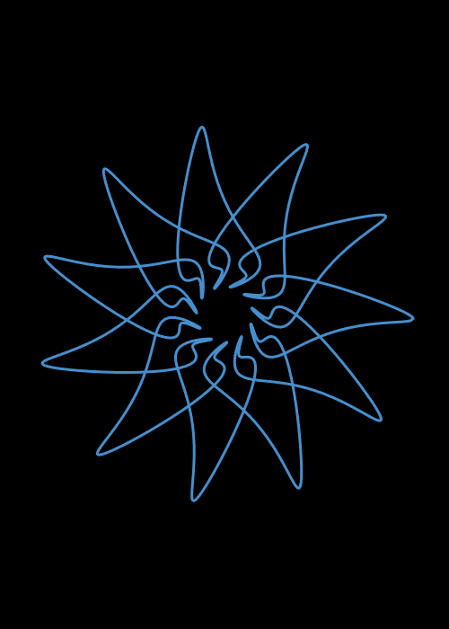
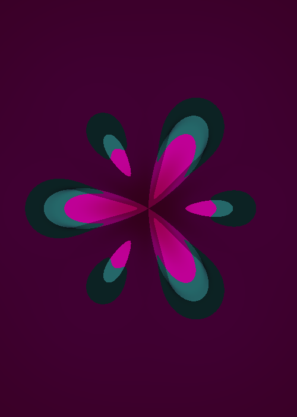
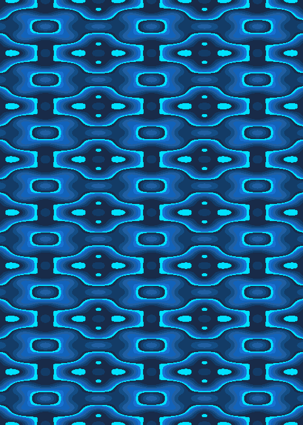

# Symmetry Sketchbook (2019-2020, 2024)

| Parametric Curves | Rosettes | Wallpapers |
| --- | --- | --- |
|  |  |  |

Mathematical symmetry experiments based on the book [Creating Symmetry](https://www.google.com/books/edition/Creating_Symmetry/mmqYDwAAQBAJ?hl=en) by Frank A. Farris.

Implemented in p5.js using WebGL for rendering.

This is the second iteration of this website. I redid the site in Vue and TypeScript since the old UI was confusing to use.

## Usage

Visit https://ptrgags.dev/symmetry-sketchbook/ to explore the website. Instructions are included on each page.


## Project Setup

```sh
npm install
```

### Run Dev Server

```sh
npm run dev
```

### Lint with [ESLint](https://eslint.org/)

```sh
npm run lint
```

### Compile for Production

```sh
npm run build
```

### Release

When ready to release an update to the site, do the following:

```sh
# Build the static site into the dist/ folder
npm run build

# Check in changes
git add dist/
git commit

# This pushes the dist/ folder to origin/gh-pages as a git subtree.
npm run deploy
```
